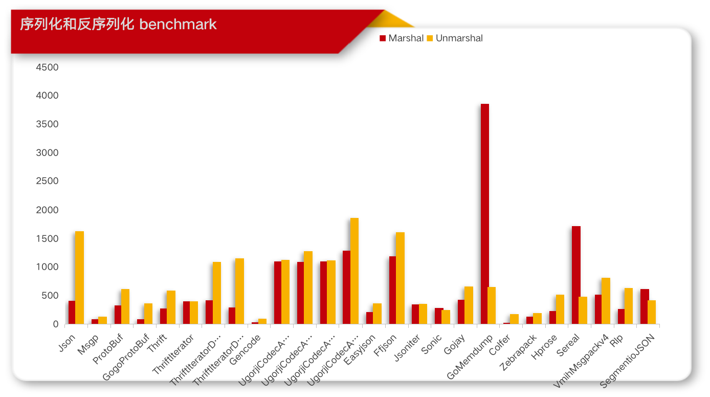
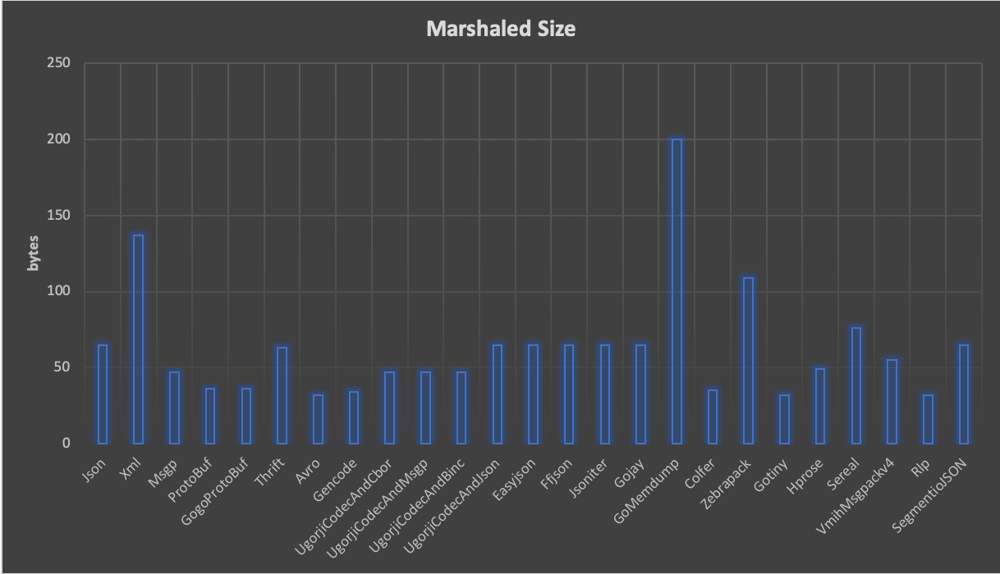

## Golang Serialization Benchmark

### Serializers

This project test the below go serializers, which compares with go standard _json_ and _xml_.

- [encoding/json](http://golang.org/pkg/encoding/json/)
- [encoding/xml](http://golang.org/pkg/encoding/xml/)
- [github.com/tinylib/msgp](http://github.com/tinylib/msgp)
- [github.com/golang/protobuf](http://github.com/golang/protobuf)
- [github.com/gogo/protobuf](http://github.com/gogo/protobuf)
- [Apache/Thrift](https://github.com/apache/thrift/tree/master/lib/go)
- [Apache/Avro](https://github.com/linkedin/goavro)
- [andyleap/gencode](https://github.com/andyleap/gencode)
- [ugorji/go/codec](https://github.com/ugorji/go/tree/master/codec)
- [colfer](https://github.com/pascaldekloe/colfer)
- [zebrapack](https://github.com/glycerine/zebrapack)
- [gotiny](https://github.com/niubaoshu/gotiny)
- [github.com/ugorji/go/codec](http://github.com/ugorji/go/codec)
- [hprose-golang](https://github.com/hprose/hprose-golang/tree/master/io)
- [vmihailenco/msgpack/v4](https://github.com/vmihailenco/msgpack)
- [Sereal](https://github.com/Sereal/Sereal)
- [ffjson](https://github.com/pquerna/ffjson)
- [easyjson](https://github.com/mailru/easyjson)
- [jsoniter](https://github.com/json-iterator/go)
- [go-ethereum/rlp](https://github.com/ethereum/go-ethereum)
- [go-memdump](https://github.com/alexflint/go-memdump)

###  Excluded Serializers

Given existed [benchmark](https://github.com/alecthomas/go_serialization_benchmarks) by alecthomas，or complexity， or activity, the below serializers are excluded from this test because of their poor performance.

- [encoding/gob](http://golang.org/pkg/encoding/gob/)
- [github.com/alecthomas/binary](http://github.com/alecthomas/binary)
- [github.com/davecgh/go-xdr/xdr](http://github.com/davecgh/go-xdr/xdr)
- [labix.org/v2/mgo/bson](http://labix.org/v2/mgo/bson)
- [github.com/DeDiS/protobuf](http://github.com/DeDiS/protobuf)
- [bson](http://github.com/micro/go-bson)
- [github.com/google/flatbuffers](http://github.com/google/flatbuffers)

### Test Environment
go version: **1.13.4**

**Test:**

```
go test -bench=.
```

### Test Data Model

All tests are using the same data model as below:

```go
type ColorGroup struct {
    ID     int `json:"id" xml:"id,attr""`
    Name   string `json:"name" xml:"name"`
    Colors []string `json:"colors" xml:"colors"`
}
`
```

### Benchmark



**Marshal**

_include marshalled bytes_

```
BenchmarkMarshalByJson-4                   	 2408637	       520.3 ns/op	        65.00 marshaledBytes	     128 B/op	       2 allocs/op
BenchmarkMarshalByXml-4                    	  389919	      3041 ns/op	       137.0 marshaledBytes	    4736 B/op	      11 allocs/op
BenchmarkMarshalByMsgp-4                   	11220867	        93.59 ns/op	        47.00 marshaledBytes	      80 B/op	       1 allocs/op
BenchmarkMarshalByProtoBuf-4               	 3287916	       367.2 ns/op	        36.00 marshaledBytes	      64 B/op	       2 allocs/op
BenchmarkMarshalByGogoProtoBuf-4           	12096730	       104.3 ns/op	        36.00 marshaledBytes	      48 B/op	       1 allocs/op
BenchmarkMarshalByThrift-4                 	 3559412	       391.1 ns/op	        63.00 marshaledBytes	      64 B/op	       1 allocs/op
BenchmarkMarshalByAvro-4                   	 3334384	       367.6 ns/op	        32.00 marshaledBytes	     112 B/op	       2 allocs/op
BenchmarkMarshalByGencode-4                	30378223	        38.41 ns/op	        34.00 marshaledBytes	       0 B/op	       0 allocs/op
BenchmarkMarshalByUgorjiCodecAndCbor-4     	 1000000	      1001 ns/op	        47.00 marshaledBytes	    1504 B/op	       6 allocs/op
BenchmarkMarshalByUgorjiCodecAndMsgp-4     	 1258886	       933.4 ns/op	        47.00 marshaledBytes	    1504 B/op	       6 allocs/op
BenchmarkMarshalByUgorjiCodecAndBinc-4     	 1290403	       894.1 ns/op	        47.00 marshaledBytes	    1504 B/op	       6 allocs/op
BenchmarkMarshalByUgorjiCodecAndJson-4     	 1000000	      1077 ns/op	        65.00 marshaledBytes	    1584 B/op	       6 allocs/op
BenchmarkMarshalByEasyjson-4               	 6468608	       191.0 ns/op	        65.00 marshaledBytes	     128 B/op	       1 allocs/op
BenchmarkMarshalByFfjson-4                 	 1600815	       739.6 ns/op	        65.00 marshaledBytes	     408 B/op	       9 allocs/op
BenchmarkMarshalByJsoniter-4               	 3355567	       364.2 ns/op	        65.00 marshaledBytes	      88 B/op	       2 allocs/op
BenchmarkMarshalByGojay-4                  	 3120411	       352.8 ns/op	        65.00 marshaledBytes	     536 B/op	       2 allocs/op
BenchmarkMarshalByGoMemdump-4              	  293272	      4105 ns/op	       200.0 marshaledBytes	    1352 B/op	      26 allocs/op
BenchmarkMarshalByColfer-4                 	42171025	        28.28 ns/op	        35.00 marshaledBytes	       0 B/op	       0 allocs/op
BenchmarkMarshalByZebrapack-4              	 8410303	       174.7 ns/op	       109.0 marshaledBytes	     127 B/op	       0 allocs/op
BenchmarkMarshalByGotiny-4                 	 4003556	       300.4 ns/op	        32.00 marshaledBytes	     144 B/op	       5 allocs/op
BenchmarkMarshalByHprose-4                 	 3809161	       321.6 ns/op	        49.00 marshaledBytes	      24 B/op	       1 allocs/op
BenchmarkMarshalBySereal-4                 	  680457	      1627 ns/op	        76.00 marshaledBytes	     728 B/op	      22 allocs/op
BenchmarkMarshalByVmihMsgpackv4-4          	 2115049	       565.9 ns/op	        55.00 marshaledBytes	     232 B/op	       5 allocs/op
BenchmarkMarshalByRlp-4                    	 4013892	       315.4 ns/op	        32.00 marshaledBytes	      64 B/op	       3 allocs/op
BenchmarkMarshalBySegmentioJSON-4          	 2330972	       439.3 ns/op	        65.00 marshaledBytes	    1072 B/op	       2 allocs/op
```


**Unmarshal**

```
BenchmarkUnmarshalByJson-4                 	  729801	      1705 ns/op	     248 B/op	       9 allocs/op
BenchmarkUnmarshalByXml-4                  	  117837	     13677 ns/op	    2911 B/op	      70 allocs/op
BenchmarkUnmarshalByMsgp-4                 	 7498039	       157.8 ns/op	      32 B/op	       5 allocs/op
BenchmarkUnmarshalByProtoBuf-4             	 1896331	       649.2 ns/op	     176 B/op	      11 allocs/op
BenchmarkUnmarshalByGogoProtoBuf-4         	 3178382	       363.4 ns/op	     160 B/op	      10 allocs/op
BenchmarkUnmarshalByThrift-4               	 1260399	       937.7 ns/op	     416 B/op	      11 allocs/op
BenchmarkUnmarshalByAvro-4                 	   63712	     18816 ns/op	   12330 B/op	     234 allocs/op
BenchmarkUnmarshalByGencode-4              	11907836	       102.5 ns/op	      32 B/op	       5 allocs/op
BenchmarkUnmarshalByUgorjiCodecAndCbor-4   	 1000000	      1224 ns/op	     656 B/op	       8 allocs/op
BenchmarkUnmarshalByUgorjiCodecAndMsgp-4   	  906704	      1365 ns/op	     768 B/op	      10 allocs/op
BenchmarkUnmarshalByUgorjiCodecAndBinc-4   	 1000000	      1495 ns/op	     656 B/op	       8 allocs/op
BenchmarkUnmarshalByUgorjiCodecAndJson-4   	  592894	      2043 ns/op	    1168 B/op	      10 allocs/op
BenchmarkUnmarshalByEasyjson-4             	 2678743	       439.5 ns/op	      32 B/op	       5 allocs/op
BenchmarkUnmarshalByFfjson-4               	 1000000	      1081 ns/op	     472 B/op	      13 allocs/op
BenchmarkUnmarshalByJsoniter-4             	 2987168	       401.3 ns/op	      32 B/op	       5 allocs/op
BenchmarkUnmarshalByGJSON-4                	  869682	      1459 ns/op	     616 B/op	       7 allocs/op
BenchmarkUnmarshalByGojay-4                	 1854678	       647.4 ns/op	     280 B/op	       9 allocs/op
BenchmarkUnmarshalByGoMemdump-4            	 2214979	       555.0 ns/op	     736 B/op	       9 allocs/op
BenchmarkUnmarshalByColfer-4               	 6796684	       172.0 ns/op	      96 B/op	       6 allocs/op
BenchmarkUnmarshalByZebrapack-4            	 4861705	       247.8 ns/op	      32 B/op	       5 allocs/op
BenchmarkUnmarshalByGotiny-4               	 4232330	       361.4 ns/op	     120 B/op	       7 allocs/op
BenchmarkUnmarshalByHprose-4               	 2235748	       567.4 ns/op	     272 B/op	       9 allocs/op
BenchmarkUnmarshalBySereal-4               	 2116989	       572.9 ns/op	      80 B/op	       6 allocs/op
BenchmarkUnmarshalByVmihMsgpackv4-4        	 1303030	       919.4 ns/op	     264 B/op	      11 allocs/op
BenchmarkUnmarshalByRlp-4                  	 1599290	       744.9 ns/op	     104 B/op	      11 allocs/op
BenchmarkUnmarshalBySegmentioJSON-4        	 2571625	       474.2 ns/op	      32 B/op	       5 allocs/op
```


**Marshaled Size**

